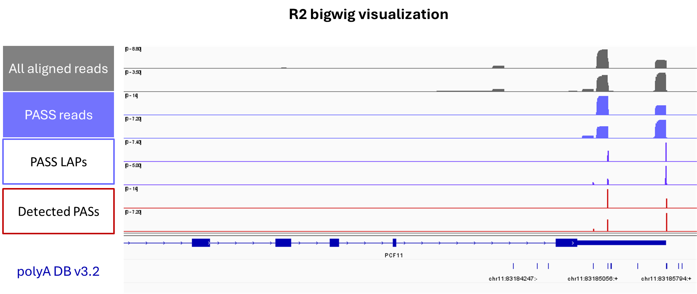

# 3-REAP-paired reads
[3'REAP (3’ Reads Enrichment using Annotated PolyA sites)](https://github.com/wly00001/3-prime-REAP)

Poly(A) site (PAS) detection and quantification using paired reads of bulk 3'-seq. This pipeline requires polyA or polyT containing reads.
If you have problem, please contact Shan Yu, syu@wistar.org, Bin Tian Lab @ The Wistar Institute.


**LAP** - Last aligned position, see Step 6.

## Introduction

## Prerequisites
### Tools
[umi_tools](https://umi-tools.readthedocs.io/en/latest/index.html), [cutadapt](https://github.com/marcelm/cutadapt/), [bbmap](https://github.com/BioInfoTools/BBMap), [STAR](), [samtools](https://github.com/samtools/samtools), [bedtools](https://bedtools.readthedocs.io/en/latest/index.html)

### R packages
tidyverse, dplyr, plyranges, GenomicRanges, GenomicAlignments, ggplot2, patchwork

### python modules
argparse, os, gzip, re, Bio

### Files
Genome reference, including fasta, chrom.sizes

PAS database table: The PAS reference used in this pipeline is derived from [PolyA_DBv3.2](https://exon.apps.wistar.org/polya_db/v3/). Our fourth version of the database will be released soon—please stay tuned!

## Pipeline
### Set the working directories and specify input files
Copy the module scripts in script_path.
All output files will be generated under work_path.
```
script_path=/your/scripts/path
fastq_path=/your/fastq_or_fq.gz/path
work_path=/your/output/path
sample_file=/your/sample_name/table/path/sample.txt

nrThreads=12 # cores

star_index_path=/star/index/path/STAR_index_hg38 # for Step 3, STAR index. # If you have no star index, please build one first.
refPAS_file=/path/PolyA_DBv3.2/human/human.PAS.hg38.txt # for Step 6, PAS annotation file from PolyA_DBv3.2
chromsizes=/genome/reference/hg38.chrom.sizes # for Step 7, Chromosome sizes file
```
### Step 1. UMI extraction
If your reads have UMI, extract them to the read names. Notice the UMI sequences will be removed from reads in the same time.
This example uses QuantSeq-Pool data, with a 10 nt UMI located in read2. **Please adjust the parameters as needed to accommodate your specific dataset.**

```shell
cd $fastq_path
while IFS=$' \t\r\n' read -r sample; do
	outpath=${work_path}/s1_fastq_umi/${sample}
	mkdir -p ${outpath}
	umi_tools extract --extract-method=string --bc-pattern X --bc-pattern2 NNNNNNNNNN \
	-I ${sample}_R1.fastq.gz \
	--read2-in=${sample}_R2.fastq.gz \
	-L ${outpath}/extraction_log \
	-S ${outpath}/${sample}_R1.fastq.gz \
	--read2-out=${outpath}/${sample}_R2.fastq.gz
done < $sample_file
```
### Step 2. Trimming adapters and polyA/polyT sequences
Given the distinct sequence characteristics of read1 and read2 — reverse reads generally contain polyT—and their differences in sequencing quality, we process them separately.
Please set the adapter sequences according to your data.
**It's important to ensure that polyA/polyT sequences have been removed from your FASTQ output by reviewing the reads and running [FastQC](https://github.com/s-andrews/FastQC).**

#### Read1 (here forward read)
```bash
cd ${work_path}/s1_fastq_umi
while IFS=$' \t\r\n' read -r sample; do
	echo $sample
	outpath=${work_path}/s2_fastq_cutadapt/${sample}
	mkdir -p ${outpath}
	cutadapt --quiet -j 24 -m 20 -O 20 -a "polyA=A{20}" -a "QUALITY=G{20}" -n 2 ${sample}/${sample}_R1.fastq.gz | \
	cutadapt --quiet -j 24 -m 20 -O 3 --nextseq-trim=10 -a "r1adapter=AGATCGGAAGAGCACACGTCTGAACTCCAGTCAC;min_overlap=3;max_error_rate=0.100000" - | \
	cutadapt --quiet -j 24 -m 20 -O 3 -a "r1polyA=A{18}" - | \
	cutadapt --quiet -j 24 -m 20 -O 20 -g "r1adapter=AGATCGGAAGAGCACACGTCTGAACTCCAGTCAC;min_overlap=20" -o ${outpath}/${sample}_R1.fastq.gz --discard-trimmed -
done < $sample_file
```
#### Read2 (here reverse read)
```shell
cd ${work_path}/s1_fastq_umi
while IFS=$' \t\r\n' read -r sample; do
    echo $sample
    outpath=${work_path}/s2_fastq_cutadapt/${sample}
    mkdir -p ${outpath}
    cutadapt --quiet -j 24 -m 18 -O 3 --nextseq-trim=10 -a "rd2Adapter=AGATCGGAAGAGCGTCGTGTAGGGAAAGAGTGT;min_overlap=3;max_error_rate=0.100000" ${sample}/${sample}_R2.fastq.gz | \
    cutadapt --quiet -j 24 -m 18 -O 20 -g "rd2Adapter=AGATCGGAAGAGCGTCGTGTAGGGAAAGAGTGT;min_overlap=20" -o ${outpath}/${sample}_R2_trimAdapt.fastq.gz --discard-trimmed -
    ### Reverse reads contain 5'Ts, remove remaining 5'Ts before the alignment
    python ${script_path}/trim_N-5T_fq.py --rawfastq ${outpath}/${sample}_R2_trimAdapt.fastq.gz --out_dir ${outpath} --random_NT_len 0
done < $sample_file
```
`--random_NT_len`: *int*. Specifies the length of the random sequence (e.g., UMI) that appears before the polyT sequence in the reverse read.  For example, if you did **not** remove the UMI using `umi_tools extract` during Step 1, you should provide its length here.  Note that `umi_tools extract` can extract the UMI, append it to the read ID, and simultaneously remove it from the original sequence.

### Step 3. Genome alignment using paired reads
Since the fastq files were preprocessed separately, they need to be repaired to re-establish read pairing before alignment. repair.sh is a tool of bbmap.
If you have no star index, please build one first.
Lenient alignment parameters were used for alignment, because the reverse reads had low sequencing quality scores, and many reads became much shorter after adapter and polyT trimming.
```shell
# pair reads repair
inpath=${work_path}/s2_fastq_cutadapt
outpath=${work_path}/s2_fastq_cutadapt_pair; mkdir -p ${outpath}
while IFS=$' \t\r\n' read -r sample; do
repair.sh overwrite=t in1=${inpath}/${sample}/${sample}_R1.fastq.gz in2=${inpath}/${sample}/${sample}_R2_trimAdapt.5Ttrimmed.fastq.gz \
           out1=${outpath}/${sample}/${sample}_R1.fastq.gz out2=${outpath}/${sample}/${sample}_R2.fastq.gz outs=${outpath}/${sample}/${sample}_unpaired.fastq.gz \
           repair
done < $sample_file

echo "align"
inpath=${work_path}/s2_fastq_cutadapt_pair
cd ${work_path}
while IFS=$' \t\r\n' read -r sample; do
	outpath=${work_path}/s3_star_align/${sample}; mkdir -p ${outpath}
	STAR --runThreadN ${nrThreads} --readFilesCommand zcat --genomeDir ${star_index_path} \
	--readFilesIn ${inpath}/${sample}/${sample}_R1.fastq.gz ${inpath}/${sample}/${sample}_R2.fastq.gz --outReadsUnmapped Fastx --outFilterType BySJout --limitBAMsortRAM 4000000000 \
	--outSAMattributes NH HI NM MD --outSAMtype BAM SortedByCoordinate --outFileNamePrefix ${outpath}/ \
	--outFilterMultimapNmax 1 --outFilterScoreMinOverLread 0.2 --outFilterMatchNminOverLread 0.2
done < $sample_file

## Statistical alignment rate
cd ${work_path}/s3_star_align
output_file="stats_STAR_summary.csv"
echo "Sample,Total Reads,Uniquely Mapped Reads (%),Mapped to Multiple Loci (%),Unmapped: Too Many Mismatches (%),Unmapped: Too Short (%),Unmapped: Other (%)" > $output_file
for logfile in */*Log.final.out; do
    #sample=$(basename $(dirname $logfile))
    sample=${logfile%%Log.final.out}
    total_reads=$(grep "Number of input reads" $logfile | awk '{print $NF}')
    uniquely_mapped=$(grep "Uniquely mapped reads %" $logfile | awk '{print $NF}')
    multiple_mapped=$(grep "% of reads mapped to multiple loci" $logfile | awk '{print $NF}')
    unmapped_mismatches=$(grep "% of reads unmapped: too many mismatches" $logfile | awk '{print $NF}')
    unmapped_short=$(grep "% of reads unmapped: too short" $logfile | awk '{print $NF}')
    unmapped_other=$(grep "% of reads unmapped: other" $logfile | awk '{print $NF}')
    echo "$sample,$total_reads,$uniquely_mapped,$multiple_mapped,$unmapped_mismatches,$unmapped_short,$unmapped_other" >> $output_file
done
```
### Step 4. Removing PCR duplication
```shell
inpath=${work_path}/s3_star_align

while IFS=$' \t\r\n' read -r sample; do
outpath=${work_path}/s4_bam_dedup/${sample}; mkdir -p ${outpath}
if [ ! -f "$inpath/$sample/Aligned.sortedByCoord.out.bam.bai" ] || [ "$inpath/$sample/Aligned.sortedByCoord.out.bam" -nt "$inpath/$sample/Aligned.sortedByCoord.out.bam.bai" ]; then
    samtools index "${inpath}/${sample}/Aligned.sortedByCoord.out.bam"
fi

umi_tools dedup --paired -I ${inpath}/${sample}/Aligned.sortedByCoord.out.bam -S ${outpath}/${sample}.dedup.bam \
--multimapping-detection-method=NH --output-stats=${outpath}/deduplicated.txt --log=${outpath}/deduplication.log
done < $sample_file
```

### Step 5. BAM file to BED
Extract R2 reads that are successfully paired and aligned to the reference genome from the BAM file, then convert them to BED format.
```shell
outdir=${work_path}/s5_R2_bed; mkdir -p $outdir; cd $outdir
bam_path=${work_path}/s4_bam_dedup

while IFS=$' \t\r\n' read -r sample; do
    samtools view -@ ${nrThreads} -f 128 -F 4 -b ${bam_path}/${sample}/${sample}.dedup.bam > ${bam_path}/${sample}/${sample}.dedup_R2.bam
    samtools index ${bam_path}/${sample}/${sample}.dedup_R2.bam
    bedtools bamtobed -cigar -i ${bam_path}/${sample}/${sample}.dedup_R2.bam > ${sample}.dedup_R2.bed
    sort -k 1,1 ${sample}.dedup_R2.bed > ${sample}.dedup_R2.sorted.bed
done < $sample_file

wc -l *.sorted.bed >> stats_deduped_aligned_R2_reads.txt
```

### Step 6. Defining LAPs (last aligned positions) and matching PASs


`-misM 2`: Allow up to 2 nt soft clipping at the ends of aligned reads.

`-dist 24`: Assign LAPs to PASs in PolyA_DB within a ±24-nt window.

```shell
indir=${work_path}/s5_R2_bed
outdir=${work_path}/s6_LAP; mkdir -p $outdir

while IFS=$' \t\r\n' read -r sample; do
	Rscript ${script_path}/genome_LAPandPAS_define.R -bedLAP $indir/${sample}.dedup_R2.sorted.bed -out $outdir/${sample} -refPAS $refPAS_file -misM 2 -dist 24
done < $sample_file

# combine the PAS quantification table
mkdir -p ${work_path}/s6_LAP/PAS_quant; cd ${work_path}/s6_LAP/PAS_quant
mv ${work_path}/s6_LAP/*cluster.all.reads.csv ./
Rscript ${script_path}/combine_all_sample_PAS_count_tables_sy.R -csv ./ -out ./cluster.all.reads.csv
Rscript ${script_path}/combine_all_sample_PAS_count_tables_sy.R -csv ${outdir} -out ./stats_PAS.csv
```

### Step 7. Generating bigwig files for PAS usage visualization
```shell
indir=${work_path}/s6_LAP

for type in PASS_bw_LAP24 PASS_bw_LAP24_positon PASS_bw_LAP24_PAS mapped_read
do
outdir=${work_path}/s7_bigwig/${type}; mkdir -p $outdir; cd $outdir
echo "Working on ${type}..."
while IFS=$' \t\r\n' read -r sample; do
  echo "Working on $sample..."
  ## Count total read number
  totalReadNum=`wc -l $indir/${sample}_${type}.bed | sed s/[[:blank:]].*//`
  echo "for file ${sample}_PASS_bw.bed, TotalReadNum=$totalReadNum"

  sort -k 1,1 $indir/${sample}_${type}.bed > $indir/${sample}_${type}.bed.sorted

  ## it is strand-specific 
  ## Generate bedgraph file
  echo "Generate bedgraph files for + and - strands..."
  genomeCoverageBed -bg -split -i $indir/${sample}_${type}.bed.sorted -strand '+' -g $chromsizes > $sample.plus.bedgraph
  genomeCoverageBed -bg -split -i $indir/${sample}_${type}.bed.sorted -strand '-' -g $chromsizes > $sample.minus.bedgraph

  ## Normalize bedgraph counts
  echo "Normalize bedgraph counts..."
  ${script_path}/norm_bedgraph.pl -t $totalReadNum -i "$sample.plus.bedgraph"
  ${script_path}/norm_bedgraph.pl -t $totalReadNum -i "$sample.minus.bedgraph"

    ## give minus strand negative value
  awk -v FS="\t" -v OFS="\t" 'NR>1 {print $1, $2, $3, -$4}' $sample.minus.bedgraph.normolized > $sample.minus.bedgraph.normolized1 

  ## Convert to bigwig file
  echo "Convert to bigwig file..."
  bedGraphToBigWig $sample.plus.bedgraph.normolized  $chromsizes plus.$sample.$type.bw
  bedGraphToBigWig $sample.minus.bedgraph.normolized  $chromsizes minus.$sample.$type.bw
  bedGraphToBigWig $sample.minus.bedgraph.normolized1  $chromsizes mi.$sample.$type.bw

done < $sample_file
chmod 775 *.bw #change file permission
rm -f *.bedgraph
rm -f *.bedgraph.normolized
rm -f *.bedgraph.normolized1
done
```
## Output description
`${work_path}/s6_LAP/PAS_quant/cluster.all.reads.csv` is the PAS count table.

bigwig files are under `${work_path}/s7_bigwig`. We recommend `PASS_bw_LAP24_PAS` or `PASS_bw_LAP24` for PAS usage visualization. `mapped_read` is for all aligned R2 reads .`PASS_bw_LAP24` is for PAS supporting (PASS) reads. `PASS_bw_LAP24_positon` is for PASS LAPs. `PASS_bw_LAP24_PAS` is for detected PASs. 



Some QC files: `${work_path}/s3_star_align/stats_STAR_summary.csv`, `${work_path}/s5_R2_bed/stats_deduped_aligned_R2_reads.txt`, `${work_path}/s6_LAP/*_stats.csv`, `*_CIGAR_distrib.pdf` and `*_LAP_polyAdb3_distance.pdf`.

## Next
You can annotate gene and 3'UTR/Intron for the PAS count table using PAS table from [PolyA_DBv3.2](https://exon.apps.wistar.org/polya_db/v3/), then perform alternative polyadenylation (APA) analysis.

## Authors
[Shan Yu](https://github.com/ShanYu-bioinfo/), [Luyang Wang](https://github.com/wly00001), [Bin Tian](https://www.wistar.org/our-scientists/bin-tian/).
